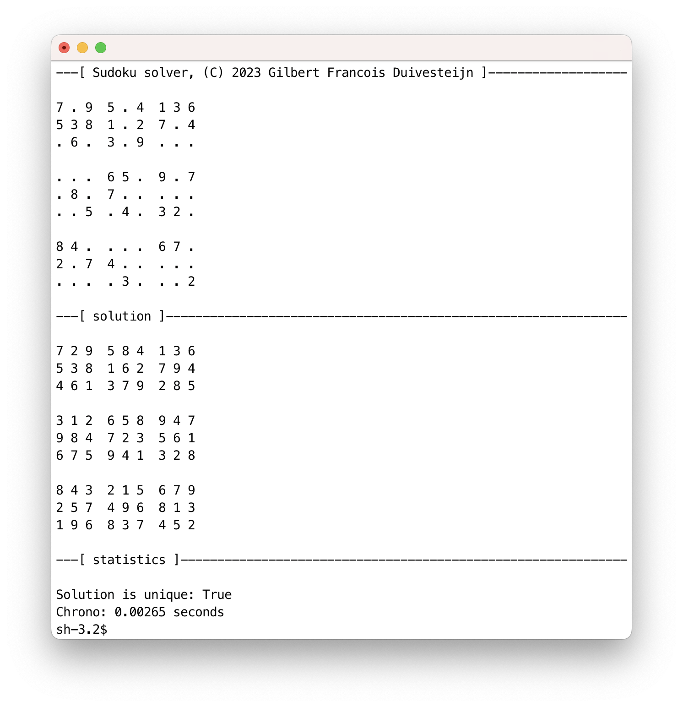

# Sudoku Solver
_Gilbert François Duivesteijn_

## Abstract

This a terminal application that solves all your sudoku puzzles. It reads the initial state from a file and solves the puzzle. The implemented method to solve the sudoku puzzles is as simple as beautiful. It searches for an empty cell and fills in the first possible digit. Then it calls its own function to find the next possible digit. As soon as the solver is stuck, it unrolls to the previous state and tries the next possible number, until it has solved all cells in the puzzle. The application in its current state can solve the _easy_, _medium_, _hard_, _expert_ and _evil_ levels without problems. Moreover, when the puzzle has a non-unique solution, it finds all possible solutions!


There are 2 versions of this program. One written in **C** and one in **Python**. *The C version is approximately 40 to 80 times faster.*

|  |  |
| ---------------------------------------------------------- | --------------------------------------------------------- |
| Python version, runtime: 0.00265 seconds.                  | C version, runtime: 0.00006 seconds.                      |


## Building and running the C version

Compile the program with:

```sh
cd cc
cmake -B build -S . -DCMAKE_BUILD_TYPE=Release
cmake --build build
cmake --install build
```


Run the program with:

```sh
cd dist
./sudoku <filename>

# example
./sudoku ../../examples/easy_001.txt
```


## Running the python version

Install Python version 3.10 or higher. Run the program with:

```sh
cd py/src/
python sudoku.py <filename>

# example
python sudoku.py ../../examples/easy_001.txt
```


## Data file format

The input file can have 2 different formats: grid format or list format. The grid format expects the digits in 9 by 9 grid, where the empty cells are denoted by a dot. 

```
.9. .1. ..7
..5 76. ..4
.2. ... ..6

.5. .7. 9..
... ... ...
4.. .8. ..1

... 2.6 ...
..2 ..8 1..
.8. .5. 3..
```
There are some example data files in the `examples` folder.


## Nerd section


### C

To do...


### Python

Besides building a very robust solver, much effort has been put in making beautiful pure python code.  It was a explicit choice to write the program in plain python, without any external libraries, like numpy.

The application has been developed with the following code quality tools:

- [Type hints.](https://docs.python.org/3.10/library/typing.html)
- [Black](https://github.com/psf/black) for formatting.
- [isort](https://pycqa.github.io/isort/) for sorting imports.
- [pdb++](https://github.com/pdbpp/pdbpp) for visual debugging in the terminal.
- [poetry](https://python-poetry.org) for dependency management.
- [pylint](https://pylint.org) for checking code quality.
```sh
$ pylint src/sudoku.py

--------------------------------------------------------------------
Your code has been rated at 10.00/10 (previous run: 10.00/10, +0.00)
```
- [Pytest](https://docs.pytest.org/en/7.2.x/)

```sh
$ pytest test_sudoku.py -v
============================= test session starts ==============================
platform darwin -- Python 3.10.9, pytest-7.2.0, pluggy-1.0.0 -- 
collected 19 items

test_sudoku.py::TestSudoku::test_cell_possible_false PASSED              [  5%]
test_sudoku.py::TestSudoku::test_cell_possible_true PASSED               [ 10%]
test_sudoku.py::TestSudoku::test_easy PASSED                             [ 15%]
test_sudoku.py::TestSudoku::test_evil PASSED                             [ 21%]
test_sudoku.py::TestSudoku::test_expert PASSED                           [ 26%]
test_sudoku.py::TestSudoku::test_filenotfound_exception PASSED           [ 31%]
test_sudoku.py::TestSudoku::test_grid PASSED                             [ 36%]
test_sudoku.py::TestSudoku::test_hard PASSED                             [ 42%]
test_sudoku.py::TestSudoku::test_init_repr_ PASSED                       [ 47%]
test_sudoku.py::TestSudoku::test_medium PASSED                           [ 52%]
test_sudoku.py::TestSudoku::test_message_line PASSED                     [ 57%]
test_sudoku.py::TestSudoku::test_non_unique PASSED                       [ 63%]
test_sudoku.py::TestSudoku::test_possible_false PASSED                   [ 68%]
test_sudoku.py::TestSudoku::test_possible_true PASSED                    [ 73%]
test_sudoku.py::TestSudoku::test_reset PASSED                            [ 78%]
test_sudoku.py::TestSudoku::test_solved_repr_ PASSED                     [ 84%]
test_sudoku.py::TestSudoku::test_verbose PASSED                          [ 89%]
test_sudoku.py::TestSudoku::test_wrong_dim_exception_1 PASSED            [ 94%]
test_sudoku.py::TestSudoku::test_wrong_dim_exception_2 PASSED            [100%]

============================= 19 passed in 41.48s ==============================

```
-  [Coverage](https://coverage.readthedocs.io/en/7.0.4/)

```
Name            Stmts   Miss  Cover
-----------------------------------
src/sudoku.py     171     15    91%
-----------------------------------
TOTAL             171     15    91%

```

- Test  [Coverage](https://coverage.readthedocs.io/en/7.0.4/)

```
coverage report
Name                                                  Stmts   Miss  Cover
-------------------------------------------------------------------------
src/sudoku.py                                           171     28    84%
test/test_sudoku.py                                     125      0   100%
-------------------------------------------------------------------------
TOTAL                                                   296     28    91%

```

