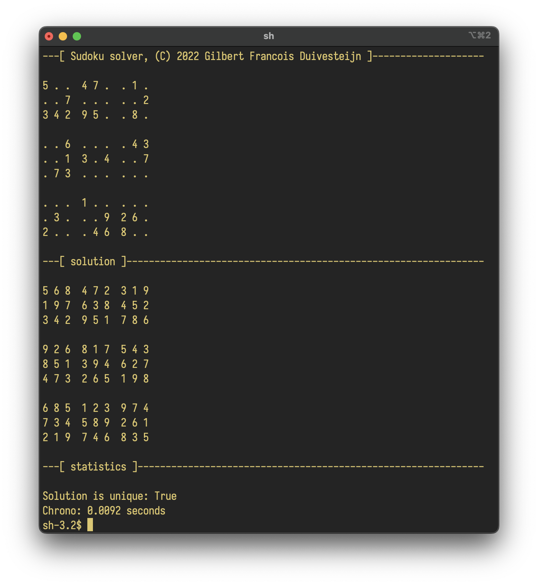

# Sudoku solver
_Gilbert François Duivesteijn_

## Abstract

This a terminal application that tries to solve your sudoku puzzle. It reads the initial state from a file and when
it finds a solution, it prints the final state to the terminal. Note: the console output is VT100 compatible :)


## Installation and running

Install python version 3.10 or higher. The program does not need any other dependencies.

Run the program with:

```sh
python sudoku [options] <filename>
```
where filename points to the input file. Options are:

| option  | Description |
|---------|-------------|
| -h      | Shows help message and exits.|
| -s / --max-steps | Maximum number of steps to solve the puzzle. Default = 10000.  |
| -v / --verbose   | Verbose output, showing history and elapsed computational time.|



## Data file format

The input file can have 2 different formats: grid format or list format. The grid format
expects the digits in 9 by 9 grid, where the empty cells are denoted by a dot. 

```
.9. .1. ..7
..5 76. ..4
.2. ... ..6

.5. .7. 9..
... ... ...
4.. .8. ..1

... 2.6 ...
..2 ..8 1..
.8. .5. 3..
```
Adding spaces or white lines is allowed.

The list format consists of a list with digits and its position as `row col digit`, e.g.:
```
# row col digit
1 2 9
1 5 1
1 9 7
2 3 5 
2 4 7
(.... etc)

```
There are some example data files in the `examples` folder.

